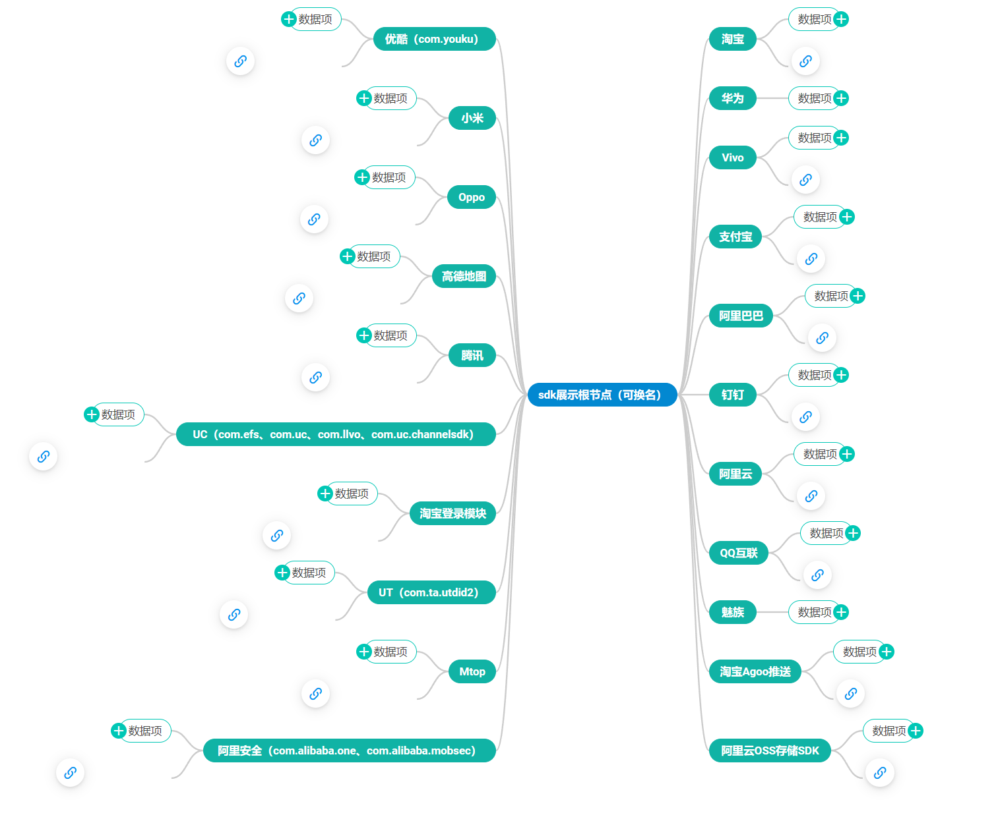
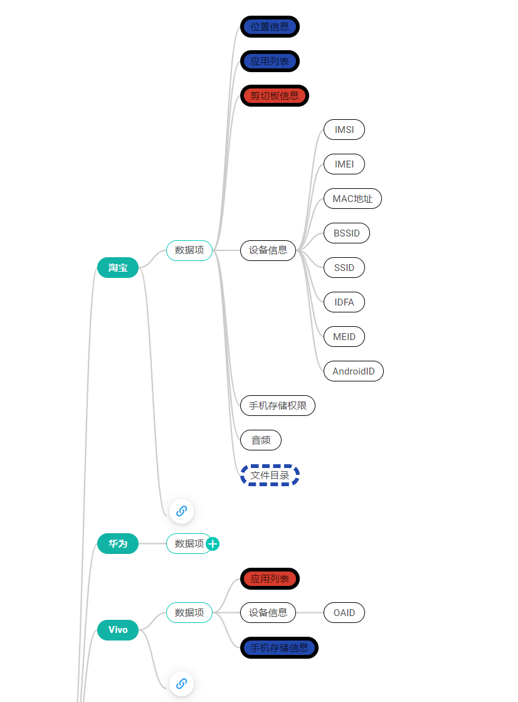
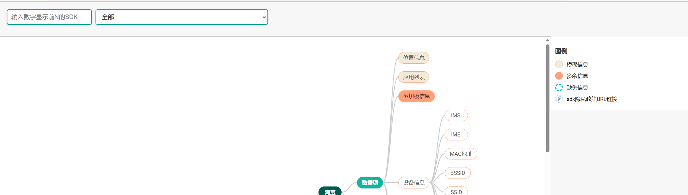

# sdk-show
展示sdk以及相关的隐私政策信息
参考文档  https://dhtmlx.com/blog/create-javascript-mindmap-diagram-dhtmlx-library/

### 原始json文件结构说明：
sdk-name 第三方sdk名称
data 数据项 需要按照顿号进行分隔（在括号内的需要进行分叉）
ori-url： 原本爬下来的url
sdk-url：确定为sdk隐私政策的链接
url：ori-url规范化为列表的链接
url-judge：判断是否为隐私政策的链接 (是隐私政策)
sdk-url-judge：判断隐私政策链接是否适用于sdk（是sdk隐私政策）

### 修改的地方：
1. 换用新的模板 使得整体结构更加紧凑
2. 不显示purpose节点
3. URL链接仅展示三个之中的一个（使用好看的图标）
4. 通过sdk名称进行检索展示（包括通过前N个高频sdk进行排序，同时支持单独检索展示） ————已修改 见第8条
5. 对于数据项的拆分，使用parse_data函数进行拆分，思路是将{"位置信息、应用列表、剪切板信息、设备信息（IMSI、IMEI、MAC地址、BSSID、SSID、IDFA、MEID、AndroidID）、手机存储权限、音频"} 这种格式的先按照括号项进行拆分，比如设备信息和它的子内容作为一个节点，之后设备信息的这些子节点再从设备信息进行分支
6. 该说未说的less-data 信息展示： 增加虚线节点进行展示，增添虚线样式加粗以进行强调，
7. 模糊的fuzzy-data 和 多说的more-data 信息展示：增加新的颜色样式和加粗样式以进行强调
8. 通过sdk名称进行检索展示（包括通过less-data、fuzzy-data和more-data的总和进行排序，同时支持单独检索展示） 初步实现：由于之前是通过在思维导图上进行样式搜索然后统计个数，此处沿用之前的想法，统计设置为特殊样式的节点（即为不合法的节点）的个数 ，然后以此作为优先级进行排序。

### 使用方法：
1. git clone 
2. 查看example.html
3. 如果希望测试新的json文件 请查看"缺陷"

### 缺陷
1. 由于CROS限制 无法访问本地文件 如果想要生成新的afterTreeData.json进行展示，需要执行python changeJson.py，将转换后的json文件结果复制到example.html的dataset字段进行展示，该问题属于次要矛盾后续再进行解决，在开发过程中首先进行数据效果的展示和调整

